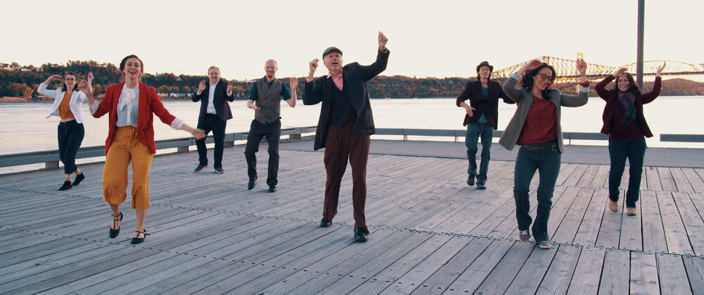
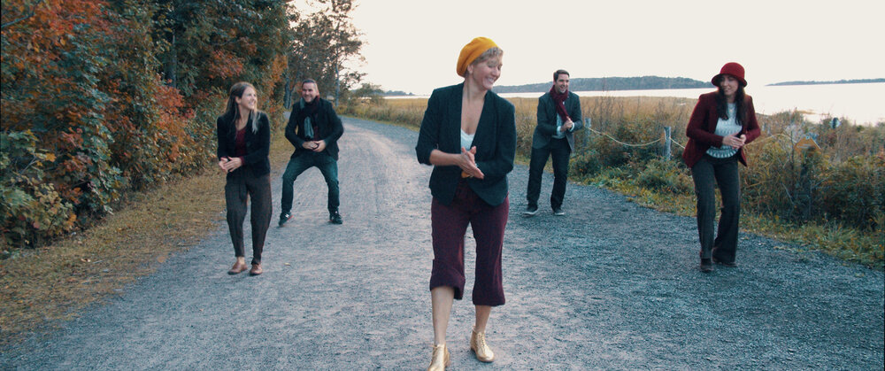
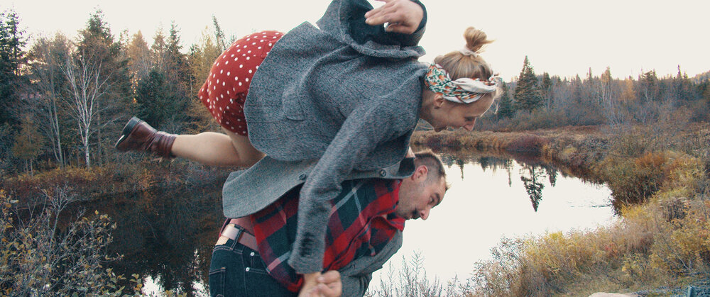

# Follow on the Road

**— director — cameraman — video editor — scenarist —**

Never done before, Follow on the Road is an independent contemporary swing dance movie. It gathered more than 100 different artists across Quebec. We designed this unique project as an exploration of the idea that dance should be an inclusive medium. This philosophy means treating the way we film dance differently. This movie is not about showing you people dancing. It is about sharing with you the feelings and emotions of being part of a dance community.

2020

------

## CREDITS

**DIRECTED BY**: Kevin Nicolas  
**PRODUCED BY**: Dominique Blouin and Kevin Nicolas  
**LEAD ACTOR**: Lily Thibodeau  
**GRAPHIC DESIGN AND ANIMATION**: Youlia Rainous  
**FILMED AND EDITED BY**: Kevin Nicolas  
**MUSIC BY:** Lily Tea & Tea for 20’s  
**COSTUMING CONSULTANT:** Jeanne Huguenin  
**SOUND DESIGN AND MIXING:** Lily Thibodeau  
**ARTISTIC CONSULTANT:** Axelle Hubert

### BRISER LE SILENCE

**CHOREOGRAPHY BY:** Lily Thibodeau
**ON THE MUSIC:** Take The A Train 
**COORDINATION**: Dominique Blouin and Erwan Jouault 
**CAMERA ASSISTANTS**: Dominique Blouin and Yam Atkins 
**DANCERS**: Armand De Asis, Daniel Repsch, Erwan Jouault, Guillaume Deschênes, Maude-Hélène Brouard, Mélanie Pasquarelli, Sophie Lundholm and Youlia Rainous

### VERNACULAR INTELLIGENCE AGENCY 

**CHOREOGRAPHY BY**: Alice Bourgasser 
O**N THE MUSIC**: Love Me or Leave Me 
**COORDINATION:** Alice Bourgasser 
**CAMERA ASSISTANT:** Erwan Jouault 
**DANCERS:** Alice Bourgasser, Catherine Desjardins, Coralie Bazinet, Dominique Jean, Marie-Ève Landry, Maryse Lebeau, Michel Campeau, Mylène Urvoy, Sandrine Lambin-Gagnon and Vicki Grenier

### JAZZ DIVISION

**CHOREOGRAPHY BY:** Alice Bourgasser 
**ON THE MUSIC:** À tout rompre 
**COORDINATION:** Alice Bourgasser 
**CAMERA ASSISTANT:** Guillaume Deschênes **
DANCERS:** Carolane Larocque, Edna Lam, Erwan Jouault, Marie-France Côté, Myriam Beauvais, Rachel Mathieu, Sandy Chenard and Youlia Rainous

### THE FOLLOWER PROJECT

**CHOREOGRAPHY BY:** Sandrine Lambin-Gagnon and Sabrina Dupras 
**ON THE MUSIC:** I Can’t Give You Anything But Love 
**COORDINATION:** Sandrine Lambin-Gagnon 
**CAMERA ASSISTANT:** Guillaume Deschênes 
**DANCERS:** Maude-Hélène Brouard, Rachel Mathieu, Sabrina Dupras and Sandrine Lambin-Gagnon

### MAISON VELOURS

**CHOREOGRAPHY BY:** Liliann Malcolm 
**ON THE MUSIC:** Delta Bound 
**COORDINATION:** Liliann Malcolm 
**CAMERA ASSISTANT:** Erwan Jouault 
**DANCERS:** Alexanne Lessard, Liliann Malcolm, Lorie-Anne Chamberland, Margaux Delmas, Marie Lanteigne, Roxane St-Amand and Sophie Lamontagne

### HAND CLAPPERS

**CHOREOGRAPHY BY:** Antoine Simard, Coralie Bazinet and Michel Campeau  
**ON THE MUSIC**: The Dipsy Doodle 
**COORDINATION**: Alice Bourgasser 
**CAMERA ASSISTANT:** Amélie Paulus 
**DANCERS:** Alice Bourgasser, Antoine Simard, Coralie Bazinet and Michel Campeau

### WHEN I GET LOW I GET HIGH

**CHOREOGRAPHY BY**: Sophie Royer 
**ON THE MUSIC:** When I Get Low I Get High 
**COORDINATION:** Dominique Blouin 
**CAMERA ASSISTANT:** Dominique Blouin 
**DANCERS:** Axelle Hubert, Dominique Blouin, Jeanne Huguenin, Lily Thibodeau and Sophie Royer

### MAMANS SWING

**CHOREOGRAPHY BY:** Sophie Royer and Dominique Blouin
**ON THE MUSIC:** Si tu vois ma mère 
**COORDINATION:** Dominique Blouin 
**CAMERA ASSISTANT:** Sophie Royer 
**DANCERS:** Axelle Hubert, Dominique Blouin, Geneviève Boily, Manon Longuépéé, Mariane Robillard, Marie-Ève Gélinas and Marie-Eve Tremblay 
**CHILDREN:** Ariel Côté, Charles Lafleur, Clément Lavergne, Edgar Beauchemin, Louis-Joseph Côté, Noa Boily-Bergeron, Raphaelle Côté and Victor Beauchemin

### SHIM SHAM 

**CHOREOGRAPHY BY:** Leonard Reed, Willie Bryant and Frankie Manning 
**ON THE MUSIC:** It Ain’t What You Do, It’s The Way That You Do It

### SHIM SHAM — LÉVIS 

**COORDINATION:** Dominique Blouin 
**CAMERA ASSISTANT:** Sophie Royer 
**DANCERS:** Geneviève Boily, Marie-Eve Tremblay, Marie-Ève Gélinas, Manon Longuépéé, Mariane Robillard, Axelle Hubert, Dominique Blouin, Sophie Royer and Lily Thibodeau

### SHIM SHAM — TROIS-RIVIÈRES

**COORDINATION:** Stéphanie Roy 
**CAMERA ASSISTANT:** Stéphanie Roy 
**DANCERS:** Andréanne Germain, Anne Matte, Gabriel Antonius, James Timmons, Jennifer Buchanan, Jonathan Johnson, Nanouk Abonnenc and Stéphanie Roy

### SHIM SHAM — SAINT-GEORGES

**COORDINATION:** Alexandre Vanasse 
**CAMERA ASSISTANT:** Dominique Blouin 
**DANCERS:** Alexandre Vanasse, Isabelle Garant, Kevin Morin, Laurence Wassmer, Marie-Eve Laflamme, Olivier Duval and Virginy Duval

### SHIM SHAM — SHERBROOKE

**COORDINATION:** Pascale Rousseau 
**CAMERA ASSISTANT:** Pascale Rousseau 
**DANCERS:** Jade-Anaïs Généreux-Gamache, Lévy LeBlanc, Marie-Andrée Mongeau, Marie-Pierre Varin, Myrthô Ouelette, Pascal Caron and Pascale Rousseau

### SHIM SHAM — VAL-DAVID 

**COORDINATION:** Stéphane Lalonde 
**CAMERA ASSISTANT:** Zoë Yalden 
**DANCERS:** Caroline Dusseault, Eliane Gendron, Karine Gendron, Lan Luu, Pascale Therreault, Stéphane Lalonde and Taylor Lukian

### SHIM SHAM — DRUMMONDVILLE

**COORDINATION:** Daisy Forest 
**CAMERA ASSISTANT:** Joëlle Leblanc 
**DANCERS:** Daisy Forest, Éloïse Bergeron, Nicolas Voyer, Olivier Samson and Roxanne Chapdelaine

### SHIM SHAM — MONTREAL

**COORDINATION:** Erwan Jouault 
**CAMERA ASSISTANT:** Youlia Rainous 
**DANCERS:** Andréanne Beaudoin Poulin, Anne Laure Bienaimé, Christelle Zebbar, Edna Lam, Erwan Jouault, Robyn Penney, Yan Cyr-Haschigk and Youlia Rainous

### SHIM SHAM — QUEBEC CITY

**COORDINATION:** Gregory Eric Fodé Sanderson
**CAMERA ASSISTANT:** Dominique Blouin 
**DANCERS:** Adam Hammes, Dominique Blouin, Érika Beaulieu, Gregory Eric Fodé Sanderson, Jeanne Huguenin, Michael O’Malley, Pierre-Olivier Parisé and Silvia Innocenti

### SHIM SHAM — RIMOUSKI

**COORDINATION:** Denis Osmani 
**CAMERA ASSISTANT:** Dominique Blouin 
**DANCERS:** Annick Buteau, Denis Osmani, Jean-Pascal Soucy, Jennie Hurwood and Lily Thibodeau

------

**PRODUCTION ASSISTANTS:** Axelle Hubert and Jeanne Huguenin 

**PHOTOGRAPHERS:** Marc-Antoine Jean and Marie-Eve Trudel ACCESSORIES: Catherine Desjardins 

**EDITORIAL TEAM:** Didier Jean-François, Maxime Juneau, Nick Williams and Pierre Guimond SPECIAL MENTIONS: Annie Lévesque, Catherine Cloutier, Félix-Antoine Bergeron, François Beauchemin, Jean-François Côté, Maria Mastorakos, Martin Picard, Michaël Labrecque and Patricia Hubert 

**THANKS TO OUR DONORS:** Alexandre Vanasse, Amrita Daigle, Anne-Marie Michaud, Annie Desjardins, Benoît Dautelle, Benoît Hubert, Bernard Huguenin, capucinechartrand, Catherine Cloutier, Catherine Lapointe, Catherine Samson-Brouard, Christine Laguë, Daniel Guenard, Dany Bergeron, Daphné Trottier, Éloïse Bergeron, Eric Hubert, Eric Leclerc, Erwan Jouault, Félix Grenier, Florence Thibodeau, Franck Martin, Gabriel Blouin, Gabriel Gosselin, Gilles Poirier, Guy Lafleur, Haithem Kristou, James Timmons, Jean Pierre Roux, Jean Thibodeau, Jean-François Poulin, Jennie Hurwood, Jennifer Buchanan Kais Yousfi, La Cabane a Swing, Louis Vallee, Luc Rivet, m-dominique, Manon de Ladurantaye, Manon Longuépée, Mariane Robillard, Marianne Bonnard, Marie-Ève Gélinas, Marie-Pier Aubin, Martin Otabe, Martin Picard, Mauricio Carvallo, Maxime Duval, mp_bourget, Mylène Urvoy, Noëlla Chênevert, Pascal Larose, Patrick Chung, Rachel Mathieu, Robyn Penney, Samuel Raymond, Sebastien Dugas, Silvia Innocenti, Sonya Banal, Sophie Royer, Stan Yen, Steeve Roy, Stephane Lalonde, Tim Lauzon, Timothée Bessette, Virginy Duval, Vladimir Romanov, Yael Acre and Yan Cyr-Haschigk 

**THANKS TO OUR PARTNERS:** La Swing Ambassade, Studio 88 Swing, Théâtre Plaza and Harlem Shoes